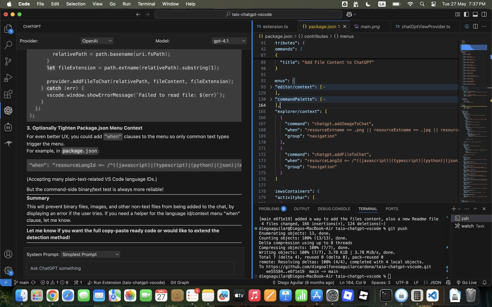
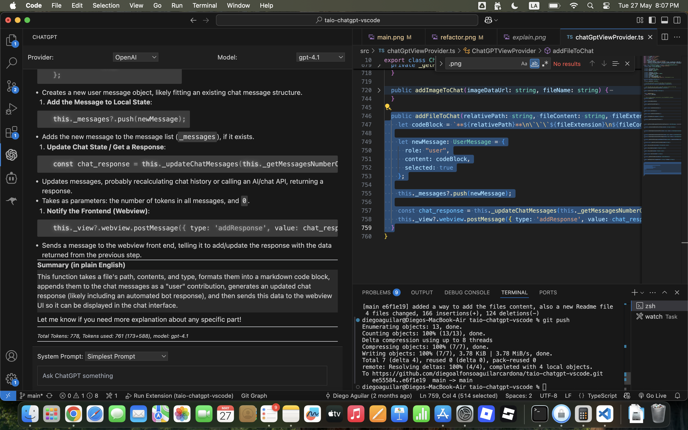
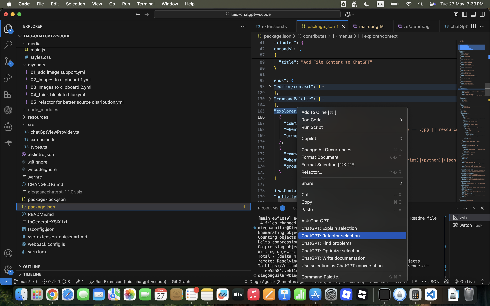

# ChatGPT for Visual Studio Code: Write and Improve Code Using AI

Enhance your development workflow by leveraging the power of ChatGPT (GPT-3.5, GPT-4, and more) directly within Visual Studio Code. Generate, explain, refactor, document, and troubleshoot your code with AI assistance, all without leaving your editor.



---

## 🚀 Features

- **Multi-provider, multi-model support**: Configure multiple AI providers and easily switch between models (e.g., OpenAI or your custom endpoints).
- **Interactive Chat Panel**: Dedicated ChatGPT side panel in the VS Code Activity Bar for ongoing conversations.
- **Code Actions**:  
	- Ask ChatGPT any coding question.
	- Explain selected code.
	- Refactor code with explanations.
	- Detect and fix bugs in code.
	- Optimize code for performance and readability.
	- Generate documentation for code snippets.
- **YAML Chat Export/Import**: Export your conversation as YAML, or import YAML conversations as sessions for reproducibility.
- **File and Image Attachments**: Send source files or images to ChatGPT by right-clicking in the explorer.
- **Custom System Prompts**: Define and select your own system prompts for specialized AI behaviors (reviewer, tutor, etc).
- **Configuration Options**: Fine-tune how code is sent (inside code blocks, with language IDs), control streaming, timeouts, and more.
- **Token Usage Tracking**: See token counts and usage for better understanding of API limits.

---

## 📦 Installation

1. Install from the [Visual Studio Code Marketplace](https://marketplace.visualstudio.com/) (or manually download the `.vsix` from releases and install via VS Code).
2. Open the **Command Palette** (`Ctrl+Shift+P`) and search for `ChatGPT: Ask`, or open the ChatGPT side panel from the Activity Bar.

---

## 🛠️ Usage Guide

### Interacting with AI

- **Chat Side Panel**: Access the ChatGPT panel from the activity bar, type your prompt, and interact with the conversation just like in a chat app.
- **Context Menu Actions**:
	- Right-click code (or select code → right-click) for quick actions like *Explain*, *Refactor*, *Find Problems*, *Optimize*, or *Document*.
	- Attach a file or image by right-clicking it in the explorer and choosing “Add to ChatGPT”.

### Export/Import Chat

- Use `ChatGPT: Paste Chat` to export the chat as YAML in your editor.
- Use `ChatGPT: Use Selection as Chat` to load a YAML conversation from the editor into your current chat session.




---

## ⚙️ Configuration

Open **Settings** (`Ctrl+,` or `Cmd+,`) and search for `chatgpt` to find and configure options such as:

<!-- Example table of key settings -->
| Setting                     | Description                                                    |
|-----------------------------|----------------------------------------------------------------|
| chatgpt.providers           | List of AI providers, API keys, API URLs, and available models.|
| chatgpt.prompts             | Your reusable system prompts for controlling AI “personality”. |
| chatgpt.pasteOnClick        | Paste code from chat code blocks on click in the editor.        |
| chatgpt.selectedInsideCodeblock | Send selected code as markdown codeblocks.                |
| chatgpt.codeblockWithLanguageId | Append language for better formatting and syntax hints.   |
| chatgpt.keepConversation    | Retain context across messages.                                |
| chatgpt.timeoutLength       | Request timeout in seconds.                                    |

### Example: Configuring Providers

```jsonc
"chatgpt.providers": [
	{
	"name": "OpenAI",
	"apiKey": "your-openai-api-key",
	"apiUrl": "https://api.openai.com/v1",
	"models": [
		{
		"name": "gpt-3.5-turbo",
		"options": {
			"temperature": 0.7
		}
		},
		{
		"name": "gpt-4",
		"options": {
			"temperature": 0.5
		}
		}
	]
	}
]
```

### Example: Adding Custom System Prompts

```jsonc
"chatgpt.prompts": [
	{
	"name": "Code Reviewer",
	"prompt": "You are a strict code reviewer. Explain suggestions thoroughly."
	},
	{
	"name": "Simple Helper",
	"prompt": "You are a helpful but concise assistant."
	}
]
```

---

## 🔒 Privacy & Security

- **Your API Keys**: You must supply your own OpenAI (or alternative) API keys. These are stored locally by VS Code and sent only to the API you select.
- **No Data is Sent to Third Parties** except your configured providers.

---

## 🧩 Extending & Contributing

### Building Locally

1. Clone this repository.
2. Install dependencies: `yarn install` or `npm install`
3. Build the extension: `yarn compile` or `npm run compile`
4. Launch in VS Code “Extension Development Host”.

### Development Notes

- Main code: [`src/extension.ts`](src/extension.ts), [`src/chatGptViewProvider.ts`](src/chatGptViewProvider.ts)
- Webview UI: [`media/`](media/)
- Configuration: [`package.json`](package.json)

PRs and feature requests are welcome. See [CONTRIBUTING.md](CONTRIBUTING.md) (create if needed) for guidelines.

---

## 📝 License

MIT License.  
This is an unofficial third-party integration. ChatGPT/OpenAI are trademarks of OpenAI, Inc.

---

## 🙋 Support & Feedback

Please open an [issue](https://github.com/timkmecl/chatgpt-vscode/issues) for bugs, support, or feature requests!

---

Happy coding!  
— The ChatGPT for VS Code Team

---

*This project is not affiliated with or endorsed by OpenAI. Use responsibly.*

---
